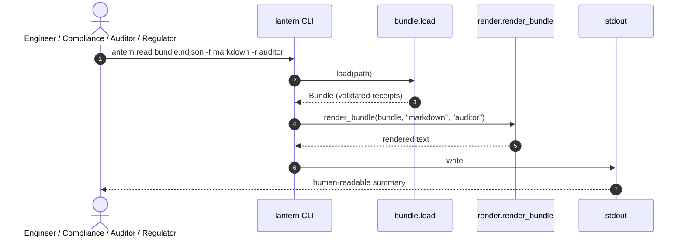
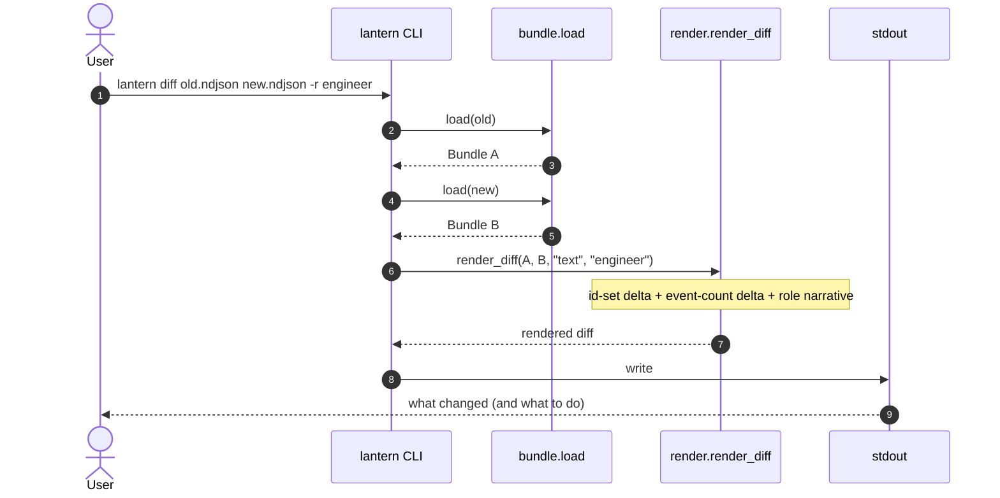
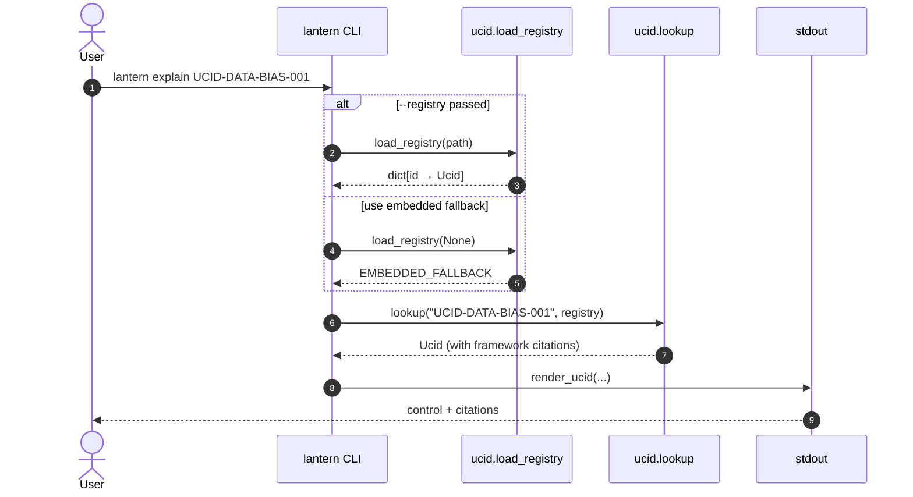
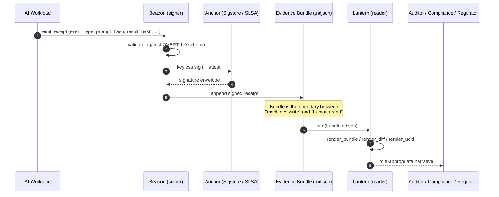
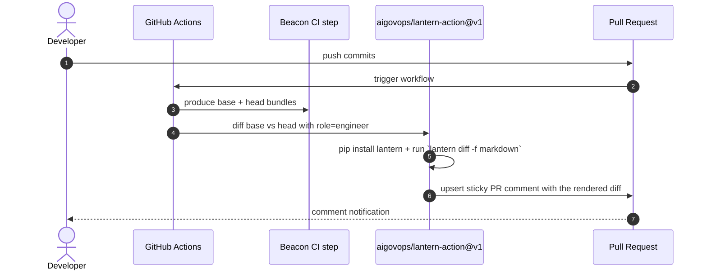

# Lantern flows

This document maps the end-to-end journeys Lantern participates in.
Each diagram is Mermaid; GitHub renders these inline.

## 1. Read a bundle (CLI today, web in v0.2)

## 2. Compare two bundles

## 3. Explain a Unified Control ID

## 4. End-to-end with Beacon (the big picture)

## 5. PR-comment workflow (planned v0.3 action)

